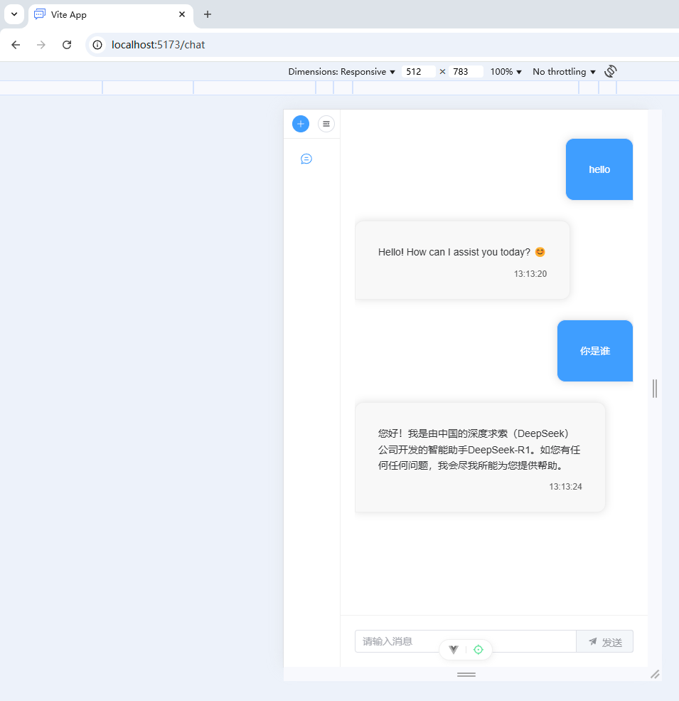

使⽤ Vue+Flask 完成⼀个 AI 小程序应⽤项⽬ 

本项目是一个典型的前后端交互项目，通过这个项目可以对前后端交互、API 接口有更深的认识。

# 成果展示





# 可以学习到的知识

**前后端分离架构**：

- **前端（Vue 3）**：使用 Vue 3 构建用户界面（采用 Element Plus 组件库），利用 Vue Router 管理页面路由（登录、注册、聊天页面）和组件化开发，同时通过 Axios 进行 API 调用。
- **后端（Flask）**：使用 Flask 构建 RESTful API，包括用户认证（注册、登录、会话管理）以及对 AI 模型的请求转发，同时利用 Flask-CORS 和 Flask-Session 处理跨域和会话问题。

**数据库集成**：

- 使用 MySQL 存储用户信息。

**AI 模型集成**：

- 将 DeepSeek R1 模型部署在独立的服务上，通过后端 API 与模型交互，处理流式 JSON 数据并转换为易读的文本输出。

**API 接口**：

* API接口定义了软件之间如何相互请求、传递数据以及返回结果。具体来说，它包含以下几点：
  - **定义调用方式**：规定了请求的格式、参数、方法（如 GET、POST）等，使得开发者可以按固定方式调用接口。
  - **抽象实现细节**：开发者只需知道如何调用 API，而无需关心内部实现细节，这提高了软件模块的解耦性。
  - **跨平台和跨语言**：通过 API 接口，不同平台、不同编程语言编写的系统也可以相互通信。
* 例如，本项目中通过调用 `http://localhost:11434/api/generate` 接口，后端可以向 DeepSeek R1 模型发送请求并接收响应，而无需关心模型内部如何生成结果。

# 需要安装的内容

## 前端

* Vue3
* vue-router
* [element-plus](https://element-plus.org/zh-CN/guide/installation.html)

## 后端

* [Python虚拟环境](https://zhuanlan.zhihu.com/p/30421510413)

* flask

* [ollama+deepseek r1:1.5b](https://zhuanlan.zhihu.com/p/28699236928)

## 数据库

* mysql

# 项目架构、每个文件及目录的详细说明

## 项目架构

```
deepseek_ai_platform
├── backend/
│		├── app.py
│		├── auth.py
│		├── chat.py
│		├── db.py
│		└── models/
│   			└── user.py
└── frontend/
	├── public/
	│	├── favicon.png
	├── src/
	│	├── App.vue
	│	├── api/
	│	│   	└── api.js
	│	├── assets/
	│	├── components/
	│	├── main.js
	│	├── router/
	│	│   	└── index.js
	│	└── views/
        │		├── Chat.vue
        │		├── Login.vue
        │		└── Register.vue
        └── index.html
```

## 前端依赖关系图

目标方依赖源头方


------

**下面是对每个文件及目录的详细说明。前端主要负责展示和交互，后端处理业务逻辑、数据库操作以及 AI 模型调用。**

## app.py（后端部分）

Flask 应用的入口文件。

功能：

- 初始化 Flask 应用、配置跨域（CORS）和会话（Session）。
- 初始化数据库，创建数据库表。
- **定义 API 路由**，如用户注册、登录、聊天，负责将请求分发给对应模块处理。

## auth.py

处理用户认证相关的逻辑。

功能：提供用户注册和登录接口的实现。

## chat.py

处理与 DeepSeek R1 模型的交互。

功能：

- 接收前端发送的聊天请求。
- 调用外部 DeepSeek R1 模型 API（例如通过 `requests.post`），解析返回的流式 JSON 数据，合并成最终文本并返回给前端。

## db.py

数据库初始化及配置。

功能：

- 使用 SQLAlchemy 作为 ORM 框架。
- 配置数据库连接字符串（例如 MySQL 连接），并提供 `init_db(app)` 函数用于在 Flask 应用中初始化数据库。

## models/user.py

定义用户数据模型。

功能：使用 SQLAlchemy 定义 `User` 类，对应数据库中的 `users` 表。


------

## src/App.vue（前端部分）

整个 Vue 应用的根组件。

功能：

- 提供全局结构和布局。
- 通过 `<router-view />` 加载由 Vue Router 渲染的具体页面组件（例如登录、注册、聊天界面）。

## src/api/api.js

前端与后端 API 通信的统一封装模块。

功能：提供函数接口（如 `register`、`login`、`chat`、`logout`）用于与后端对应 API 交互。

## src/assets/、pubilc/

两者都是为了存放静态资源，如图片、样式文件、字体等。

功能：为项目提供公共资源，可以在组件中引用这些静态文件。

两者的区别：`assets` 内的资源会被构建系统处理和优化，而 `public` 内的资源则直接提供给客户端，不经过额外处理。

## src/main.js

Vue 应用的入口文件。

功能：

- 创建 Vue 应用实例，加载根组件 `App.vue`。
- 导入并使用 Vue Router（以及其它全局插件）。
- 挂载应用到 HTML 中定义的挂载点（通常是 `#app`）。
- 引入第三方组件库，如 element-plus。

## src/router/index.js

前端路由配置文件（使用 Vue Router）。

功能：

- 定义各个页面路由和对应的组件映射，如 `/login` 映射到登录页面、`/register` 映射到注册页面、`/chat` 映射到聊天页面。
- 配置路由模式（如 `createWebHistory`），以支持前端路由的历史模式。

## src/views/

存放页面级组件。

功能：

- **Chat.vue**：聊天页面，包含用户输入区域、发送按钮和对话历史展示区；支持保存并显示每一次的对话内容。
- **Login.vue**：登录页面，提供用户输入用户名和密码，并调用 API 完成登录流程。
- **Register.vue**：注册页面，提供新用户注册功能，注册成功后跳转到登录页面。

## src/components/

存放非页面级组件。

功能：

- 用于存放可复用的 UI 组件，如通用按钮、输入框、对话气泡等。
- 具体项目中可能会进一步细分组件，提高代码的模块化和复用性。

## index.html

是浏览器加载前端应用的起点，为单页应用提供了基础的 HTML 结构和挂载点。

功能：

- **应用入口**：定义一个挂载点（通常是一个具有 `id="app"` 的 `<div>`），Vue 或其他框架的根组件会在此处渲染整个单页应用（SPA）。
- **基础 HTML 模板**：提供页面的基础结构，包括 `<head>` 中的 meta 标签、标题、链接外部 CSS、引入 JavaScript 文件等。构建工具（例如 Vite）会根据这个模板生成最终的输出文件。
- **资源引用和预加载**：你可以在 `index.html` 中引用公共资源（如 public/、外部库等），这些资源不会经过构建工具处理，而是直接被复制到输出目录。


# 前端知识点总结

* 通常页面级组件（位于 `src/views/`）会引入并使用非页面级组件（位于 `src/components/`）。这种组织结构有助于代码复用和模块化设计。页面组件负责定义整个页面布局和逻辑，而通用组件则可以在多个页面中复用，比如导航栏、表单、按钮等。
* Vue Router 是 Vue.js 官方的路由管理器，它可以帮助你在单页应用（SPA）中实现页面导航。 
  Vue Router的使用方法：
  * 安装：使用 `npm install vue-router@4` 安装 Vue Router。
  * 配置路由：在 `src/router/index.js` 中定义路由。
  * 主入口挂载：在 `main.js` 中使用 `app.use(router)` 并挂载。
  * 路由视图与链接：在 `App.vue` 中通过 `<router-view>` 展示匹配组件，通过 `<router-link>` 实现导航。


# API交互的详细过程

API交互的过程可以简单理解为 **前端发送请求 → 后端处理请求 → 返回结果给前端**。

| 步骤             | 描述                                                 |
| ---------------- | ---------------------------------------------------- |
| **前端发送请求** | 通过 `api/api.js` 用 axios 向 `/api/login` 发送请求  |
| **后端接收请求** | Flask 获取请求数据，并调用 `login_user()` 处理逻辑   |
| **后端处理数据** | 检查用户是否存在于数据库，返回登录成功或失败         |
| **前端接收响应** | 如果登录成功，跳转到聊天页面；如果失败，显示错误信息 |


## 1. 前端发送请求

在 `api/api.js` 文件里封装了前端的 API 请求：

```javascript
import axios from 'axios'

const api = axios.create({ baseURL: 'http://localhost:5000/api' })

export const register = (data) => api.post('/register', data)
export const login = (data) => api.post('/login', data)
export const chat = (data) => api.post('/chat', data)
```

- `axios.create()` 创建了一个 Axios 实例，并设置了基础路径 `http://localhost:5000/api`。
- `register()`、`login()`、`chat()` 这三个函数发送了不同的 `POST` 请求，并将用户的数据（例如账号密码或聊天内容）发送到后端。

------

## **2. 后端接收请求**

在 `app.py` 里，后端通过 Flask 定义了这些 API 路由：

```python
@app.route('/api/register', methods=['POST'])
def register():
    data = request.json  # 获取前端传过来的数据
    return register_user(data)

@app.route('/api/login', methods=['POST'])
def login():
    data = request.json
    return login_user(data)

@app.route('/api/chat', methods=['POST'])
def chat():
    data = request.json
    return chat_with_model(data)
```

- `request.json` 获取前端发送的数据。
- 调用 `register_user()`、`login_user()`、`chat_with_model()` 进行具体的业务逻辑处理。
- 最后 `return` 结果给前端。

------

## **3. 后端处理业务逻辑**

比如 `auth.py` 文件里处理用户登录：

```python
from models.user import User
from db import db
from flask import jsonify

def login_user(data):
    username = data.get('username')
    password = data.get('password')

    user = User.query.filter_by(username=username).first()
    
    if user and user.check_password(password):
        return jsonify({"message": "Login successful"})
    
    return jsonify({"error": "Invalid credentials"}), 401
```

- 从数据库中查找用户。
- 检查用户输入的账号和密码是否匹配。
- 如果匹配，返回 `"Login successful"`。
- 如果不匹配，返回错误信息。

------

## **4. 前端接收后端返回的结果**

在 `Login.vue` 里：

```javascript
import { login } from '../api/api'

export default {
  data() {
    return { username: '', password: '' }
  },
  methods: {
    async handleLogin() {
      const response = await login({ username: this.username, password: this.password })
      if (response.data.message === 'Login successful') {
        this.$router.push('/chat') // 登录成功，跳转到聊天页面
      }
    }
  }
}
```


## 总结

在此项目中，与两个文件有关： `app.py`、 `api/api.js`

- **后端**：
   `app.py` 定义了 `/api/register`、`/api/login` 和 `/api/chat` 等 API 接口，负责处理来自前端的请求，并调用相应的业务逻辑（例如用户认证、调用 DeepSeek 模型等）。
- **前端**：
   `api/api.js` 封装了对这些 API 接口的调用，使用 Axios 发送 HTTP 请求给后端。

前后端的交互主要是通过这些 API 接口实现的，而这两个文件分别是后端 API 的入口和前端 API 的封装层。


## 涉及大模型时，如何进行交互？

前端发送请求——>后端接收请求——>**后端向大模型发送请求——>大模型接收请求——>大模型处理业务逻辑——>大模型将结果送回后端**——>前端接收后端返回的结果。

本质上还是这四步：前端发送请求——>后端接收请求——>后端处理业务逻辑——>前端接收后端返回的结果。


